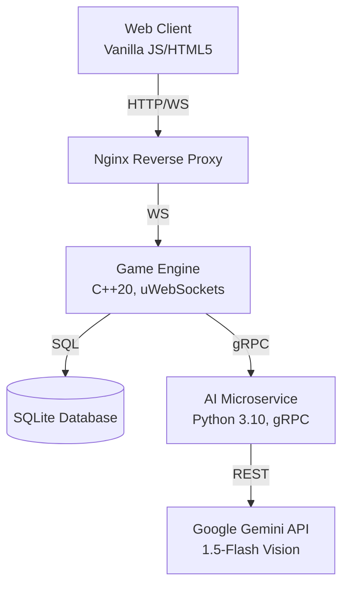

<div align="center">
  
  <h1>🎨 DrawFusion</h1>
  <p><strong>A real-time multiplayer drawing game built with C++ and Google Gemini.</strong></p>
</div>

---

## 📖 Overview

DrawFusion is a multiplayer drawing game where players join a lobby, receive AI-generated prompts, and draw their interpretations within a time limit. It uses the **Google Gemini API** to analyze the final drawings and provide a similarity score against the prompt, along with feedback.

The project uses a custom **C++20 WebSocket server** to handle network synchronization, embedded SQLite for persistent storage, and a Python microservice for AI inference. 

## 🏗️ System Architecture

DrawFusion uses a microservices architecture to handle game logic and AI tasks separately.



### Core Components
1. **Frontend (Vanilla JS/HTML5)**: A browser client that handles canvas rendering, lobby state UI, and WebSocket communication.
2. **Game Engine (`backend-cpp`)**: Written in C++20 using `uWebSockets`. It orchestrates lobby synchronization, manages SQLite database storage, and handles game timers.
3. **AI Microservice (`ai-service`)**: A Python-based gRPC server that connects to the Google Gemini API. Decoupling the AI logic ensures the C++ engine remains unblocked during image analysis.

## ✨ Key Features

- **Google Gemini Integration**: Uses `gemini-1.5-flash` for generating prompts, hints, and scoring the final canvas drawings via multimodal vision-inference.
- **BYOK (Bring Your Own Key)**: The lobby Host provides a Google Gemini API key during lobby creation. The server holds this in volatile memory for that specific lobby session. You can also start a Free Trial lobby without a key for a single round.
- **Lobby Administration**: Only the Host can start the game once all players are ready. The Host can also manage players in the lobby.
- **API Rate Limits**: Players are limited to 1 Hint per round to conserve API usage.
- **Session Cleanup**: If the host leaves or disconnects, the server broadcasts a termination signal, cleaning up the lobby. Player sessions and temporary data are cleared from SQLite upon disconnect.

---

## 🚀 Getting Started

You can run DrawFusion locally using Docker.

### Prerequisites
- Docker and Docker Compose
- A free [Google Gemini API Key](https://aistudio.google.com/app/apikey)
- A tool like Ngrok (optional, for exposing to the internet)

### 1. Launch the Server Stack
Clone the repository and run Docker Compose to build and start the containers.
```bash
docker-compose up --build -d
```
*(Note: The initial build may take a few minutes as dependencies are compiled).*

### 2. Tunnel to the Internet (Optional)
To play with others, expose your local port 80 using Ngrok:
```bash
ngrok http 80
```

### 3. Play
1. Open the local address (or the Ngrok URL).
2. Enter a username and click **Create New Lobby**.
3. Provide your Google Gemini API Key.
4. Share the lobby code with friends to start playing.

---

## 🛠️ Local Development (Building from Source)

To build the C++ engine directly without Docker:

### Prerequisites
- GCC 13.3+ (or equivalent C++20 compiler)
- CMake 3.20+
- vcpkg
- Python 3.10+

### Building the C++ Server
```bash
cd backend-cpp
cmake -B build -DCMAKE_TOOLCHAIN_FILE=/path/to/vcpkg/scripts/buildsystems/vcpkg.cmake -DCMAKE_BUILD_TYPE=Release
cmake --build build -j$(nproc)
```

### Running the Services

**1. AI Microservice** (Terminal 1)
```bash
cd ai-service
python3 -m venv .venv
source .venv/bin/activate
pip install -r requirements.txt
python3 server.py
```

**2. Game Engine** (Terminal 2)
```bash
cd backend-cpp
./build/drawfusion_server
```

**3. Frontend Client** (Terminal 3)
```bash
cd frontend
python3 -m http.server 5500
```
Navigate to `http://localhost:5500` in your browser.