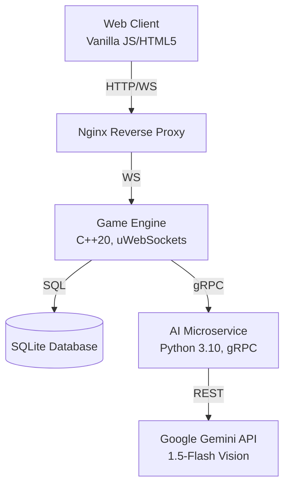

<div align="center">
  
  <h1>🎨 DrawFusion</h1>
  <p><strong>A blazing-fast, AI-judged, real-time multiplayer drawing game built with C++ and Google Gemini.</strong></p>
</div>

---

## 📖 Overview

DrawFusion is a fully distributed multiplayer drawing game where players join a lobby, receive quirky AI-generated prompts, and race against the clock to draw the best interpretation. What makes DrawFusion unique is the **AI Art Judge**—a Google Gemini-powered agent that natively "looks" at your canvas, calculates a visual similarity score against the prompt, and delivers hilariously chaotic, personalized feedback to every player.

Built to be exceptionally lightweight and ultra-performant, DrawFusion uses a custom **C++20 WebSocket server** to handle network synchronization, embedded SQLite for persistent storage, and a decoupled Python microservice for AI inference. 

## 🏗️ System Architecture

DrawFusion follows a high-performance, minimalist microservices architecture designed to minimize latency while entirely abstracting the heavy LLM tasks away from the core game engine.



### Core Components
1. **Frontend (Vanilla JS/HTML5)**: A highly interactive, zero-dependency browser client. Handles real-time canvas rendering, lobby state UI synchronization, and WebSocket orchestration.
2. **Game Engine (`backend-cpp`)**: The heart of the application. Written in modern C++20 utilizing `uWebSockets` for blistering fast concurrent network I/O. It orchestrates lobby synchronization, manages SQLite schema enforcement, and calculates absolute UTC timers for anti-cheat synchronization.
3. **AI Microservice (`ai-service`)**: A Python-based gRPC server that acts as a bridge to the Google Gemini API. By decoupling the AI logic via gRPC, the C++ engine never blocks while waiting for the LLM to analyze images.

## ✨ Key Features

- **Google Gemini Integration**: 100% powered by `gemini-1.5-flash`. The API naturally handles text-generation for quirky prompts and hints, as well as multimodal vision-inference to actively judge the final canvas drawings.
- **BYOK (Bring Your Own Key)**: To keep hosting completely free, the lobby Host simply drops in a single Google Gemini API key during lobby creation. The server securely holds this in volatile memory to power the AI for that specific lobby session.
- **Strict Lobby Administration**: Only the Host can start the game, and only when all present players explicitly hit "Ready". The Host also holds the power to kick AFK or disruptive players.
- **API Rate Limit Protections**: The server physically blocks spam. For example, players are hard-capped at exactly **1 Hint per round**, ensuring your free Gemini tier is never exhausted.
- **Anti-Ghosting Logic**: If the host leaves or disconnects, the C++ server instantly broadcasts a termination signal, safely wiping the lobby and kicking all players back to the main menu.
- **Ephemeral State**: Player accounts are tied to their active WebSocket connection. When they disconnect, their session, canvas data, and credentials are wiped from the SQLite database to preserve storage space.

---

## 🚀 Getting Started (Live Demo)

If you want to host this game yourself for free and play with friends online, you can run it locally and tunnel it to the internet!

### Prerequisites
- Docker and Docker Compose
- A free [Google Gemini API Key](https://aistudio.google.com/app/apikey)
- A free Ngrok account (for tunneling)

### 1. Launch the Server Stack
Clone the repository and spin up the Docker containers. The C++ engine and Python microservice will automatically compile and link.
```bash
docker-compose up --build -d
```
*(Note: The first build will take a few minutes as vcpkg compiles the C++ networking libraries from source).*

### 2. Tunnel to the Internet
To let your friends join, expose your local Docker container (port 80) to the public internet using Ngrok:
```bash
ngrok http 80
```

### 3. Play!
1. Copy the secure `https://....ngrok-free.app` URL provided by your terminal.
2. Send that URL to your friends!
3. Open the URL yourself, enter a username, click **Create New Lobby**, paste your Google Gemini API Key, and share the 6-letter lobby code with your friends!

---

## 🛠️ Local Development (Building from Source)

If you wish to contribute or modify the C++ engine directly without Docker:

### Prerequisites
- GCC 13.3+ (or equivalent C++20 compiler)
- CMake 3.20+
- vcpkg
- Python 3.10+

### Building the C++ Server
```bash
cd backend-cpp
cmake -B build -DCMAKE_TOOLCHAIN_FILE=/path/to/vcpkg/scripts/buildsystems/vcpkg.cmake -DCMAKE_BUILD_TYPE=Release
cmake --build build -j$(nproc)
```

### Running the Services
You must run all three components concurrently for the system to function.

**1. AI Microservice** (Terminal 1)
```bash
cd ai-service
python3 -m venv .venv
source .venv/bin/activate
pip install -r requirements.txt
python3 server.py
```

**2. Game Engine** (Terminal 2)
```bash
cd backend-cpp
./build/drawfusion_server
```

**3. Frontend Client** (Terminal 3)
```bash
cd frontend
python3 -m http.server 5500
```
Navigate to `http://localhost:5500` in your browser.